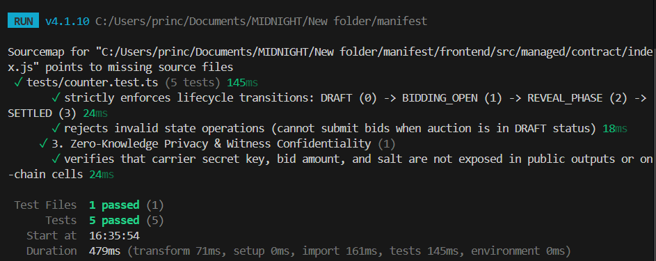

# Manifest — Zero-Knowledge Freight Tendering Protocol

> Cryptographic sealed-bid reverse auctions for B2B freight procurement on Midnight Network.

---

## Contract Addresses

| Network  | Address |
|----------|---------|
| Preview  | `mn1q_preview_msym32de` |
| Preprod  | `mn1q_preprod_1f34c4e95df9de61` |

---

## Architecture

### The Proof Lifecycle & Privacy Model

```
┌─────────────────────────────────────────────────────────────┐
│                    MANIFEST PRIVACY MODEL                    │
├─────────────────────────────────────────────────────────────┤
│                                                             │
│  PUBLIC LEDGER (visible to all):                            │
│  ┌─────────────────────────────────────────────────────┐    │
│  │ • tenderId            • biddingDeadline              │    │
│  │ • shipper (pk)        • revealDeadline               │    │
│  │ • loadHash            • tenderStatus                 │    │
│  │ • carrierCommitments  • lowestDisclosedBid           │    │
│  │ • awardedCarrier      • reservePriceCommitment       │    │
│  └─────────────────────────────────────────────────────┘    │
│                                                             │
│  PRIVATE WITNESSES (never on-chain):                        │
│  ┌─────────────────────────────────────────────────────┐    │
│  │ • bidAmount (carrier's actual rate quote)            │    │
│  │ • salt (random commitment salt)                      │    │
│  │ • carrier identity (proven via caller context)       │    │
│  └─────────────────────────────────────────────────────┘    │
│                                                             │
└─────────────────────────────────────────────────────────────┘
```

#### What an Observer CAN Learn (Public On-Chain Data)
* **Tender Existence & Parameters**: Auction ID, shipper public key, origin/destination payload hash (`loadHash`), reserve price commitment hash, and bidding/reveal block timestamps.
* **Auction Lifecycle Phase**: Current phase (`DRAFT`, `BIDDING_OPEN`, `REVEAL_PHASE`, `SETTLED`, or `CANCELLED`).
* **Participant Activity**: Total count of participating carriers and their individual sealed commitment hashes (`hash(tenderId, carrierPk, amount, salt)`).
* **Final Settlement Outcome**: Upon auction conclusion, the single winning rate (`lowestDisclosedBid`) and the awarded carrier public key.

#### What an Observer CANNOT Learn (Protected Zero-Knowledge State)
* **Losing Carrier Bid Amounts**: Losing bids remain 100% confidential and are never revealed or stored on-chain.
* **Bidder Rate Margins & Pricing Strategies**: Competitor carriers and third-party brokers cannot inspect submitted bids during or after the bidding window.
* **Preimages & Cryptographic Salts**: Carrier private salts and private keys (`local_secret_key()`) never leave the local client witness memory.
* **Unrevealed Bids & Collusion Vectors**: Without the carrier's secret preimage, no party can reverse-engineer bids or front-run pricing.

### Auction Flow

1. **Shipper Creates Tender** → Load specs hashed, bidding window set
2. **Bidding Opens** → Carriers submit sealed commitments: `hash(tenderId, pk, bidAmount, salt)`
3. **Reveal Phase** → Carriers prove commitment preimage via ZK proof
4. **Settlement** → Lowest valid bid wins; winner declared; state locked

### Why This Matters

| Traditional Freight Bidding | Manifest (ZK) |
|----------------------------|---------------|
| Carriers see each other's bids | All bids sealed until reveal |
| Race to the bottom on pricing | Fair reverse auction |
| Intermediaries exploit data | No bid data leaks to third parties |
| Manual dispute resolution | Cryptographic proof of fairness |
| No verifiability | Public audit trail with ZK proofs |

---

## Tech Stack

| Layer | Technology |
|-------|-----------|
| **Smart Contract** | Compact DSL (Midnight Network) |
| **ZK Proofs** | Midnight Proof Server |
| **Frontend** | Next.js 14 (App Router), TypeScript |
| **Styling** | Tailwind CSS, shadcn/ui |
| **Wallet** | Lace (Midnight browser extension) |
| **Containerization** | Docker (proof server) |
| **KDF** | PBKDF2 (deterministic salt derivation) |

---

## Local Setup

### Prerequisites

- Node.js >= v22.0.0
- Docker (for proof server)
- Compact Developer Tools (`compact --version`)
- Lace wallet browser extension (for testing)

### 1. Install Dependencies

```bash
# Root
npm install

# Frontend
cd frontend && npm install && cd ..
```

### 2. Compile the Contract

```bash
npm run compile
```

This compiles `contracts/manifest.compact` and generates circuit artifacts + TypeScript typings in `managed/`.

### 3. Start Proof Server

```bash
# Pull and run the Midnight proof server
docker pull midnightnetwork/proof-server
docker run -d --name manifest-proof-server --restart unless-stopped -p 6300:6300 midnightnetwork/proof-server

# Verify
curl -s http://localhost:6300/health
```

### 4. Run Tests

```bash
npm test
```




### 5. Start Frontend

```bash
cd frontend
npm run dev
# Open http://localhost:3000
```

---

## Project Structure

```
manifest/
├── contracts/
│   └── manifest.compact         ← Core Compact contract & circuits
├── managed/                     ← Auto-generated circuits & TS wrappers
├── frontend/                    ← Next.js 14 App
│   ├── src/
│   │   ├── app/                 ← App Router pages
│   │   ├── components/          ← UI components
│   │   ├── lib/
│   │   │   ├── midnight/        ← SDK integration
│   │   │   ├── crypto/          ← KDF & commitments
│   │   │   └── indexer/         ← Event store
│   │   └── types/               ← Domain entities
│   └── tailwind.config.ts
├── tests/
│   ├── manifest.unit.test.ts    ← Circuit & logic tests
│   └── manifest.e2e.test.ts     ← Multi-party auction simulation
├── scripts/
│   ├── deploy.ts                ← Automated deploy
│   └── seed.ts                  ← Testnet seeder
├── .github/workflows/ci.yml     ← CI pipeline
└── README.md
```

---

## MCP Server Integration

For AI-assisted development with the Midnight MCP server:

**Claude Desktop** — Add to `claude_desktop_config.json`:
```json
{
  "mcpServers": {
    "midnight": {
      "command": "npx",
      "args": ["-y", "@midnight-ntwrk/mcp-server"]
    }
  }
}
```

**Cursor** — Settings → MCP: `npx -y @midnight-ntwrk/mcp-server`

---

## Initial Idea

<!-- TODO: Describe the initial idea and motivation behind Manifest -->

---

## Screenshots

### Smart Contract & Compact Circuit Test Suite


---

## License

MIT
